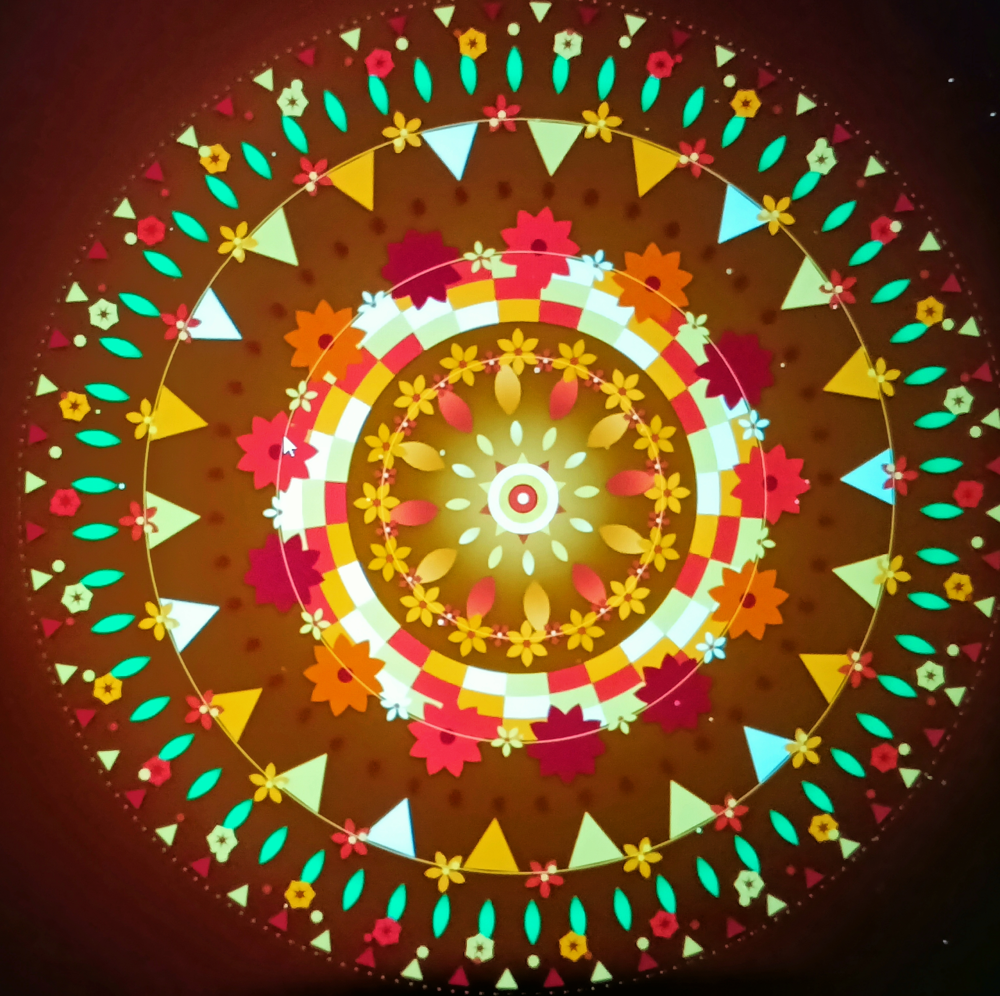

# 🌸 Vrinda's Pookalam 2026 🌸

## 👨‍💻 About Me
- **Name:** Vrindalekshmi D 
- **Branch:** CSE(CS3)
- **Semester:**S1
- **Contact Number:** 8078393488
- **Programming Language Used:** HTML,CSS,JS
## 🎨 My Pookalam

### Description
Maavora 🌸

Maavora is a digital Pookalam created using HTML, CSS, and JavaScript, inspired by the vibrant colors and traditional floral patterns of Kerala’s Onam celebrations. The design combines traditional Pookalam elements with a modern interactive web experience, showcasing how technology can be used to preserve and creatively represent Kerala’s cultural heritage.

### Preview

*Add more images if you have multiple views or animations*

### Features
Features of Maavora

- Interactive digital Pookalam
- Traditional Kerala-inspired floral design
- Colorful and creative visual patterns
- Smooth animations and interactive effects
- Responsive design for different screen sizes
- Built using HTML, CSS and JavaScript
- Combines Kerala’s cultural heritage with modern web technology

## 🚀 How to Run

### Prerequisites
A modern web browser such as Chrome, Edge or Firefox

## 📁 File Structure
```
Code-A-Pookalam/
├── README.md 
├── submission .html(webpage , style, interactive 
```

